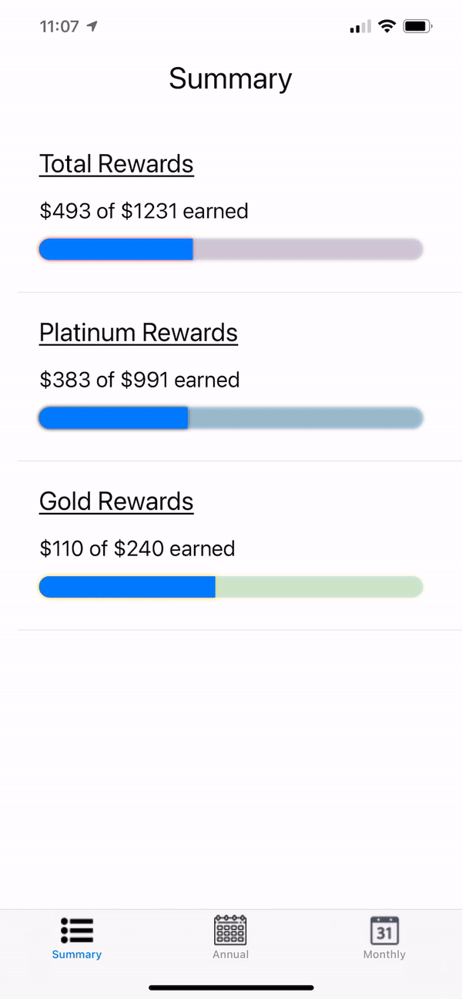
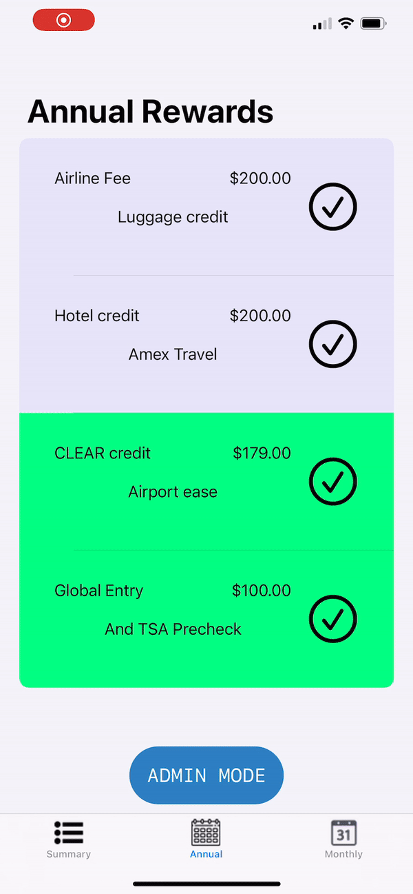

# Amex Rewards Tracker

An iPhone app where you can track all of the rewards that you are redeeming with your Amex Gold / Platinum Card(s).

This app was made because the Amex app and online AmericanExpress website do not have any good UI to display how
much of the total possible rewards you have take advantage of (probably because this makes it harder to track and
fully take advantage of).

The reward tracking is fully customizable in that you can add any kind of custom reward to it, which felt important
in the case of:
1) Reward changes throughout the year, like in mid-2021 when fee was increased and new benefits added.
2) Some rewards mean more to you than others. Some people would not have paid for a certain benefit had it not been
included with the Amex card, so maybe they don't consider that as high in value. With custom rewards, gauging the
value of any rewards is up to the user's discretion.

Here's an example of some app usage:
* You can see the Summary page, showing the monetary amount redeemed out of the total that could be redeemed.
* On the left, you can see an example of checking off a reward that you just redeemed (which will update Summary too).
* On the right, you can see an example of adding a new custom reward to the app based on the reward's properties.

    
    

